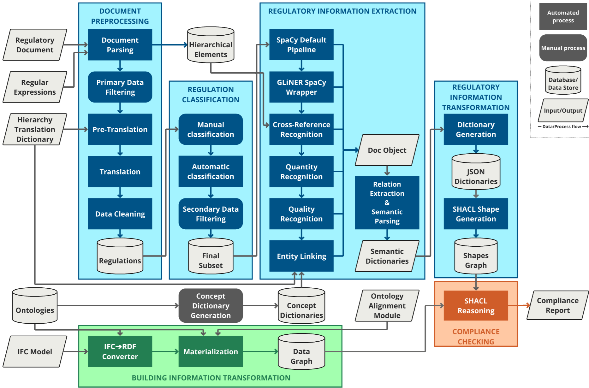

# A Framework for Fire Safety: Processing Regulatory Texts for ACC Using NLP and Semantic Web Techniques

This repository contains the Proof of Concept implementation of a conceptualized framework for Automated Compliance Checking of fire safety regulations using NLP and Semantic Web technologies. The system is developed as part of a master's thesis at Eindhoven University of Technology (TU/e). The goal of the research in the thesis was to create a modular framework that extracts semantic information from fire safety regulations and applies these rules to building information models for compliance validation. 

The Proof of Concept consists of several separate Jupyter notebooks, implementing the system architecture in the figure below. The notebooks perform the following three tasks:
1. The processing of regulatory information from natural language into SHACL shapes;
2. The processing of building information from IFC models into RDF graphs;
3. The generation of a compliance report based on the compliance of the building information in the RDF graphs with the regulatory information in the SHACL shapes.

**EXPLAIN HOW THIS IS DONE USING LINKED DATA, ONTOLOGIES, ETC**

The modular system architecture allowed for a clear separation of processing steps and supported the intended pipeline from natural language input to rule checking. The Proof of Concept demonstrates that, even with relatively simple components, each stage of the ACC process can be independently built, tested, and improved. However, the results also show many limitations and underline the need for a more sophisticated system, as the current implementation of the framework is very rudimentary and insufficient for practical use.

## Inputs
**EXPLAIN WHAT IS NEEDED FOR THIS PROCESS: REGULATORY INFORMATION, BUILDING INFORMATION, KNOWLEDGE BASES**

The system uses the following input files:

- `BBl_2024-8-1.txt` -- a plain-text version of Dutch building regulations from the [BBL]([https://wetten.overheid.nl/BWBR0041297/2024-08-01](https://wetten.overheid.nl/BWBR0041297/2024-08-01)), which is used as the regulatory information;
- `use_case_correct.ifc` -- an IFC-SPF BIM model of a compliant building, used as a test case for SHACL validation;
- `use_case_incorrect.ifc` -- an IFC-SPF BIM model of a non-compliant building, used to test detection of violations;
- `custom_ontology.ttl`-- a custom ontology containing concepts related to fire safety to fill the gaps of the used external ontologies;
- `ontology_alignment.ttl`-- an RDF graph that links the concepts from various ontologies in order to align them.

## Libraries
The following libraries are used throughout the notebooks (installed using `!pip install`):
- `deep_translator` (used for translation of the regulations)
- `rdflib` (used for querying databases and the RDF conversion of building information)
- `spacy`(used as NLP pipeline and for classification)
-   `gliner_spacy`(used for Named Entity Recognition)
-   `pyshacl` (for SHACL reasoning and materialization)
-   `ifcopenshell` (for parsing the IFC file)

## Modules

### 1A. Preprocessing
This notebook parses regulatory documents and isolates relevant regulations for further processing.
-   **Input**: `BBL_2024-8-1.txt` (regulatory document)
-   **Steps**:
	- Document parsing
	- Primary data filtering
	- Translation
	- Data cleaning
-   **Outputs**: Structured CSV files with article metadata and raw text:
	-  `BBL_hier_elements.csv`  (containing information about all hierarchy elements)
	-   `output/BBL_subset.csv`  (containing information about regulations remaining after primary data filtering)

### 1B. Rule Classification
This notebook classifies regulations and filters them based on their classifications.
- **Input**: `BBL_subset.csv` (regulations)
-  **Steps**: 
	- Rule classification (Clarity, Syntactic Complexity, Validation Complexity, Referral Complexity)
	- Secondary data filtering
	- Manual filtering
-   **Outputs**:  Annotated regulation databases with assigned classification tags:
	- `BBL_subset_final_big.csv` (automatically selected subset based on classifications)
	- `BBL_subset_final_small.csv` (handpicked smaller subset for effective demonstration)

**INCLUDE PROPOSED CLASSIFICATIONS?**

### 1C. Information Extraction & Parsing
This notebook contains the core NLP engine of the pipeline, which can be used for converting regulations into a machine-readable format.
-   **Inputs**: 
	- `output/BBL_hier_elements.csv` (hierarchical elements)
	- `BBL_subset_final_big.csv` (regulations)
	- `BBL_subset_final_small.csv` (regulations)
	- External ontologies ([ifcOWL](https://cramonell.github.io/ifc/ifcowl/IFC4X3_ADD2/actual/ontology.ttl), [BEO](https://cramonell.github.io/beo/actual/ontology.ttl), [PROPS](https://raw.githubusercontent.com/maximelefrancois86/props/refs/heads/master/IFC4-output.ttl), [UNIT](https://qudt.org/vocab/unit/))
-   **Steps**:
	-   Part-of-Speech (POS) tagging
	-   Dependency parsing
    -   Named Entity Recognition (NER)
    -  Entity Linking (EL)
    -   Relation Extraction (RE)
    -  Semantic Parsing
-   **Outputs**: Structured JSON with interpreted rules:
	- `regulatory_information_subset_big.json`
	- `regulatory_information_subset_small.json`

### 1D. Shapes Graph Generation
This notebook converts the interpreted regulatory information from JSON dictionaries to SHACL shapes for validation. The notebook also demonstrates how the SHACL templates are defined and validates them using simple regulations and the building information from module 2, along with the compliance report function from module 3. 
-   **Inputs**: 
	- `regulatory_information_subset_small.json` (handpicked regulations) 
	- `use_case_correct.ttl` (for template validation)
	- `custom_ontology.ttl` (for template validation)
	- `ontology_alignment.ttl` (for template validation)
-   **Steps**: 
	- SHACL template definition (including validations)
	- Target conversion
	- Constraint conversion
-   **Output**: SHACL shapes graph: `shapes.ttl` 

### 2. Building Information Processing
This notebook converts IFC building models to RDF graphs, with and without materialization.  
-   **Inputs**: 
	- `use_case_correct.ifc` (correct use case model)
	- `use_case_incorrect.ifc` (incorrect use case model)
	- `custom_ontology.ttl`(for materialization)
	- `ontology_alignment.ttl` (for materialization)
	- External ontologies [BEO](https://cramonell.github.io/beo/actual/ontology.ttl) & [UNIT](https://qudt.org/vocab/unit/) (for materialization)
-   **Steps**:
	-  IFC conversion
    -   Materialization
-   **Outputs**: RDF graphs of the building information:
	- `use_case_correct.ttl` (correct building information)
	- `use_case_incorrect.ttl` (incorrect building information)
	- `use_case_correct_materialized.ttl` (materialized correct building information)
	- `use_case_incorrect_materialized.ttl` (materialized incorrect building information)

### 3. Compliance Checking
This notebook runs SHACL validation of the building information against the regulations in the small subset. The notebook also demonstrates various methods for compliance checking.

-   **Inputs**: RDF building model, SHACL shapes
	- `use_case_correct.ttl` (correct building information)
	- `use_case_incorrect.ttl` (incorrect building information)
	- `use_case_correct_materialized.ttl` (materialized correct building information)
	- `use_case_incorrect_materialized.ttl` (materialized incorrect building information)
	- `shapes.ttl` (regulatory information)
	- `custom_ontology.ttl`(for demonstration of real-time inference)
	- `ontology_alignment.ttl` (for demonstration of real-time inference)
	- External ontologies [BEO](https://cramonell.github.io/beo/actual/ontology.ttl) & [UNIT](https://qudt.org/vocab/unit/) (for demonstration of real-time inference)
    
-   **Steps**:
	- Subset validation
	- Method comparison & validation
-   **Outputs**: Compliance reports:
	-	`compliance_report_correct.ttl` (correct use case compliance report graph)
	-	`compliance_report_correct.json` (correct use case compliance report dictionary)
	-	`compliance_report_incorrect.ttl` (incorrect use case compliance report graph)
	-	`compliance_report_incorrect.json` (incorrect use case compliance report dictionary)

